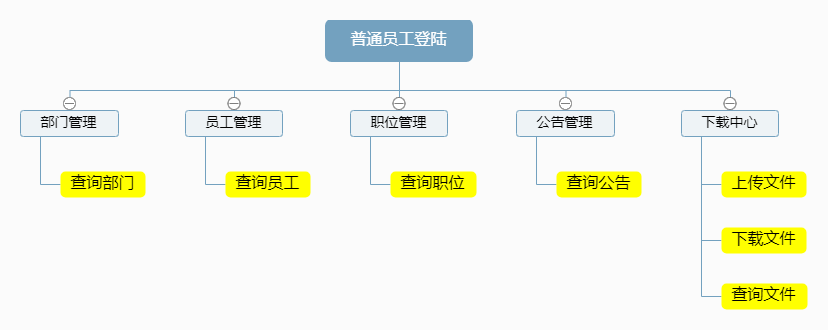
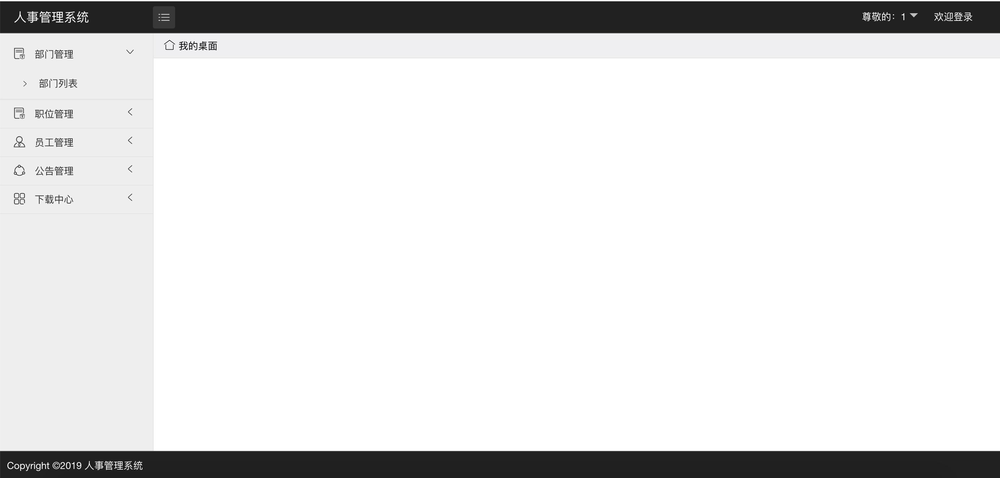
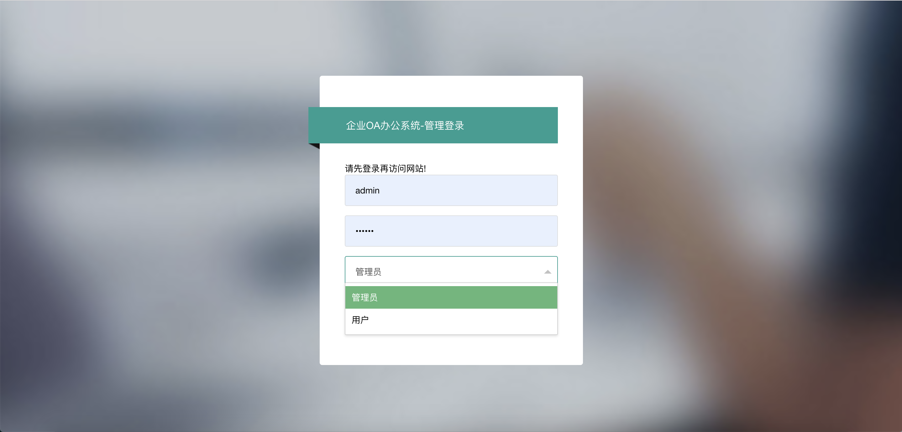
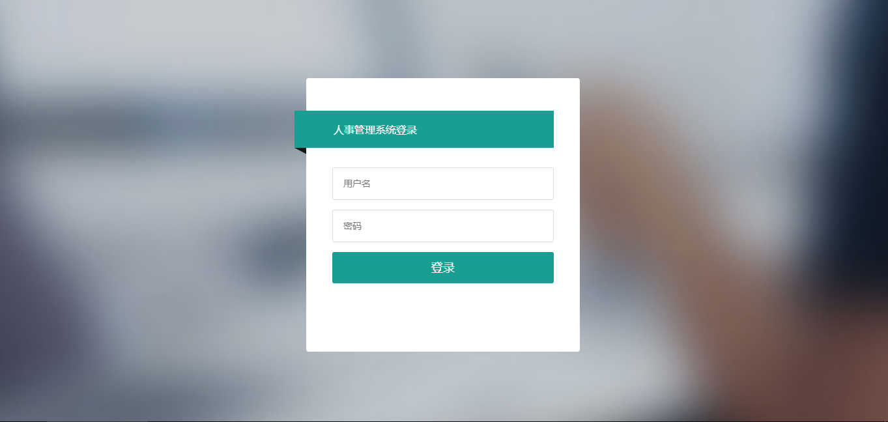
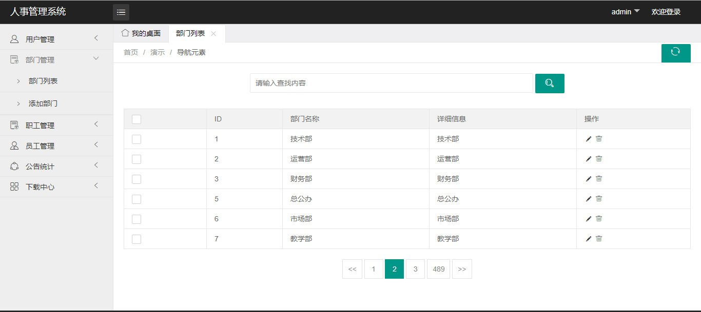

# 人事管理系统

## 因为同学答辩已经完成，项目暂时不会再做更新，有需要的朋友可以自行完善。

## 部署说明：
基础环境：JDK8，Tomcat8，MySQL5.7
报错可以查看我的教程：[我的教程](https://github.com/rainweb521/My-tutorial)
2019年4月27日

## 加入了普通用户的功能，在登陆时可以选择，可以查询职位，部门，公告，文档，但不能对其他的进行修改。

2019年4月4日

## 这个项目还是比较完整和基础的，适合改一些毕设，因为没有用到Maven，都是基础的框架，代码结构和逻辑比较简单，之前写的还有些bug，后续我会继续修改的，希望能帮助到大家。
## 有问题的可以加入这个群：226520254，大家一起交流
- - - -

## 使用JavaEE开发，基于SpringMVC+Mybatis框架，该项目包含了用户管理、部门管理、职位管理、员工管理、公告管理、下载中心等多个模块,页面使用JQuery框架完成动态功能,用户管理、部门管理等模块包含了项目开发中常用的增删改查动作,下载中心包含了 Spring MVC的文件上传、下载等功能

## 系统功能介绍
用户管理的功能包括：添加用户，用户可以为管理员或者普通用户;查询用户，可以查询所有用户或根据用户名和用户状态进行模糊查询，删除用户，修改用户。
部门管理的功能包括：添加部门，查询部门，可以查询所有部门或根据部门名称进行模糊查询，删除部门，修改部门
职位管理的功能包括：添加职位，查询职位，可以查询所有职位或根据职位名称进行模糊查询，删除职位，修改职位
员工管理的功能包括：添加员工，查询员工，可以查询所有员工或根据员工姓名，身份证号，手机号，性别，职位，部门进行模查询，删除员工，修改员工。
公告管理的功能包括：添加公告，查询公告，可以查询所有公告或根据公告名称，公告内容进行模糊查询，删除公告，修改公告。
下载中心的功能包括：上传文件，查淘文件，可以查询所有文件或根据文件标题进行模糊查询，预览文件内容：删除文件，下载文件。

